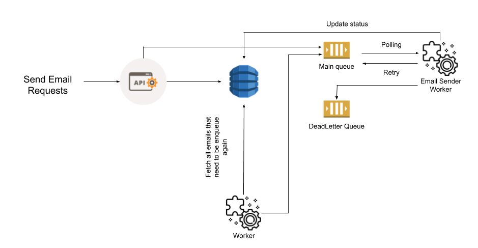
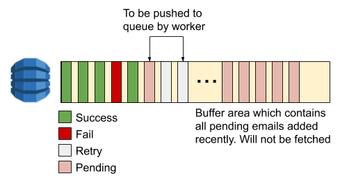

# nest-mail-service
[](https://travis-ci.org/immanuel192/nest-mail-service)
[](https://coveralls.io/github/immanuel192/nest-mail-service?branch=master)
[](https://travis-ci.org/immanuel192/nest-mail-service)

## System Diagram
### Tech stack
NestJS/Typescript, MongoDB, Redis, Queue



How system works:
- Client will POST /api/email to send email. 
- The endpoint will:
  - Perform validation to check the request payload.
  - New email document will be created in mongodb database
  - Dispatch a message to `main` queue. 
  - Immediately response to client HTTP 201 Created with email id
  - If can not create new document, immediately response HTTP 500
  - If can create new document but can not dispatch message to `main` queue, api still response HTTP 201
- `Email Sender Worker` will:
  - Long polling from the `main` queue. I use [`rsmq`](https://www.npmjs.com/package/rsmq) to implement `main` queue, but it can easily replaced with SQS.
  - Set the message visibility to prevent other worker instance pull this message again.
  - Attempt to send email
  - If success, delete message from the queue
  - If fail, update message status together with the visibility to let it available again in the queue for next time retry
  - In case if can not retry at all after a configured number of retries, it will dispatch a message to `DeadLetter` queue for analysis and mark the email document as `Failed`
- `Worker` will:
  - Run every 30 mins
  - Try to scan any email documents that need to be enqueue again. This will be backup solution in case API did not dispatch message successfully.
  - Dispatch message to `main` queue





- We also have internal components to support exponential backoff and circuit breaker mechanism when selecting email provider

### App scaling
- All the endpoints are very light load. Can scale easily.
- To clear the queue faster, we can increase the number of `Email Sender Worker` instances.

### Things that can be improved
- For the `Worker`, acquire mutex lock before executed to prevent other `Worker` instance to run while it running
- Data sharding to improve write performance.
- Switch to use Lambda
   
## Versioning
We use `semantic-release` to generate release notes. This make use of [conventional commit structure](https://www.conventionalcommits.org/en/v1.0.0-beta.4/) for both the notes and release numbers.


### Setup your working environment:
- Available tasks
```sh
npm install
docker-compose up -d  # to start the app by docker, including mongodb container
npm run start:local # to start app in your local machine, that will connect to docker mongodb container
npm run start:local:watch # to start app and watch for any changes
npm run test # to run unit test
npm run test:e2e  # to run integration test
npm run test:watch # to test app and keep watching files change
npm run cover # to get code coverage
```

- To start develop new feature, you can create your own config `mylocal.json` file as below. Remember to run `docker-compose up -d` first to init mongo and redis container
```json
{
  "mongodb": {
    "host": "localhost:27020",
    "user": "",
    "password": "",
    "database": "mails",
    "replicaSet": ""
  },
  "redis": {
    "host": "localhost",
    "port": "6380",
    "db": 2
  }
}

```

### Using docker
- Run
```sh
docker-compose up -d
```

## API Documentation
There is swagger integrated to help you easier navigate through all exposed restful api. Please follow:
```sh
npm run start
open http://localhost:9001/api/
```

### Release Production:
- Create Github and NPM [tokens](https://github.com/immanuel192/semantic-release-sample) (only need to do one time)
- Export these tokens into your `~/.bash_profile` and source it:
```sh
export GH_TOKEN={your github token}
export NPM_TOKEN={your npm token} # should be optional
```
- Run `npm run release`
